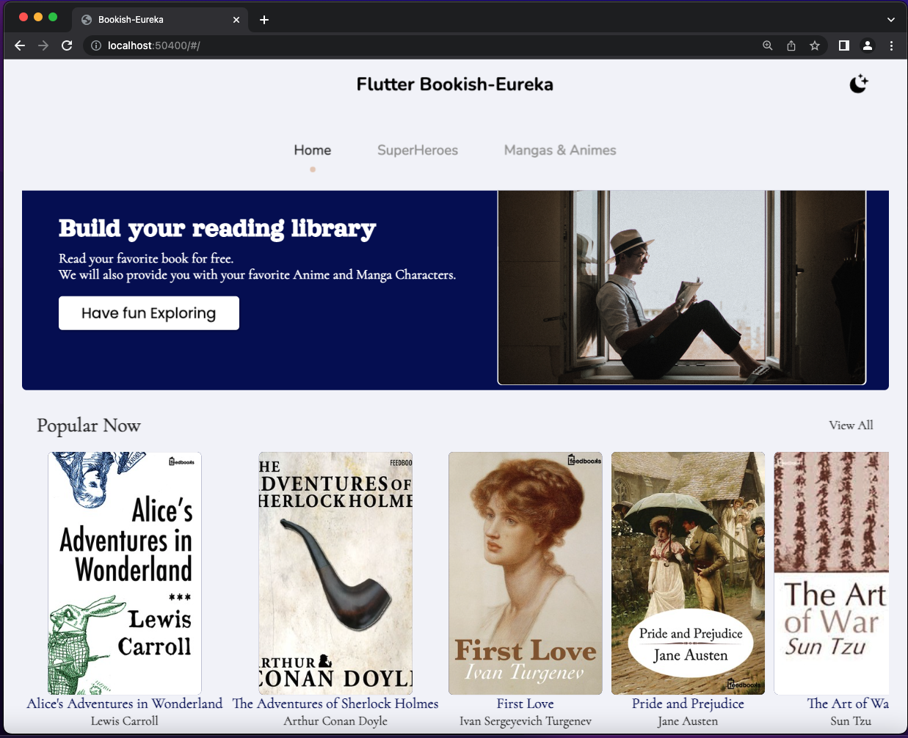
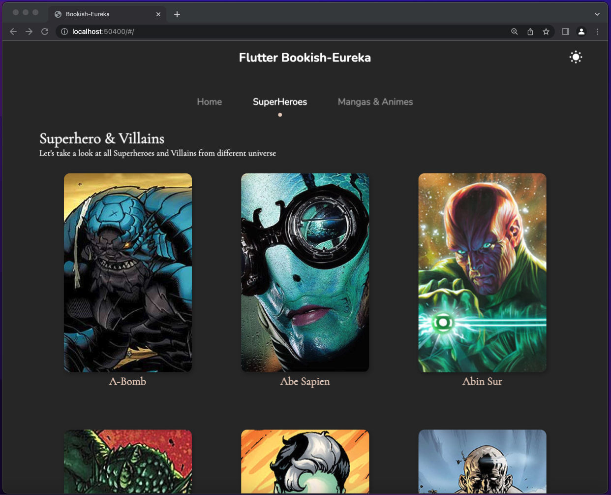
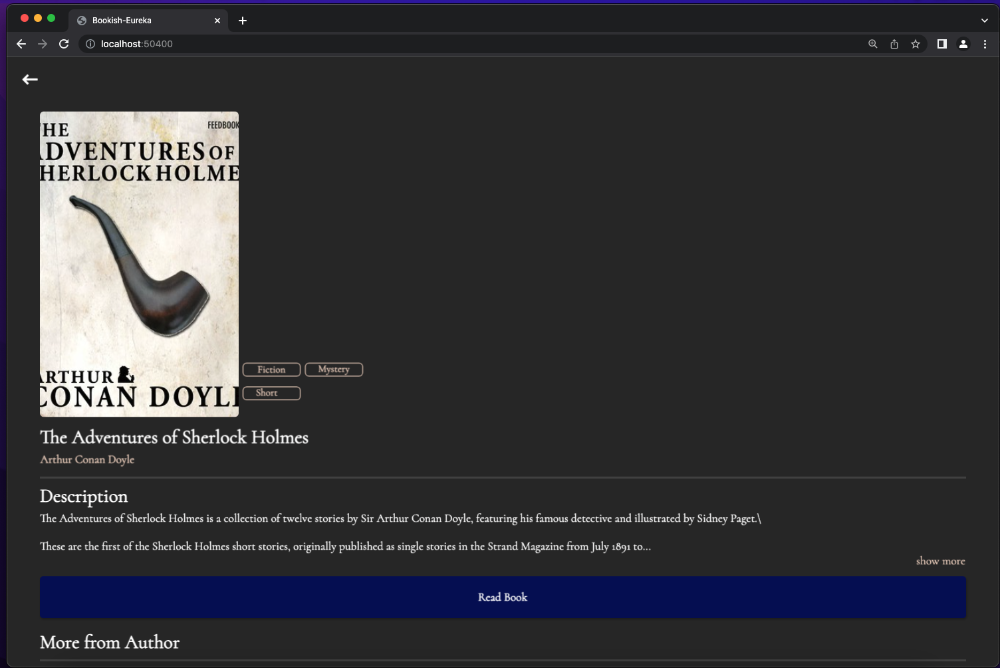
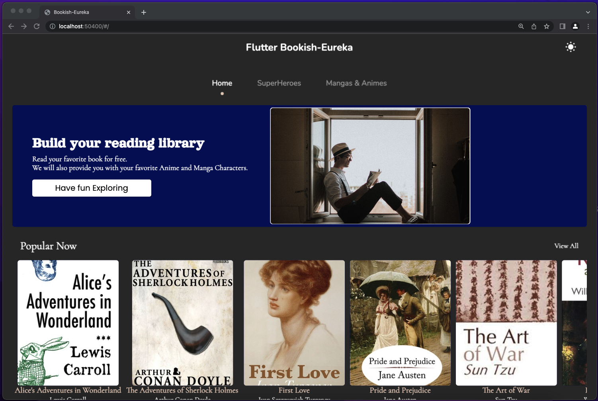
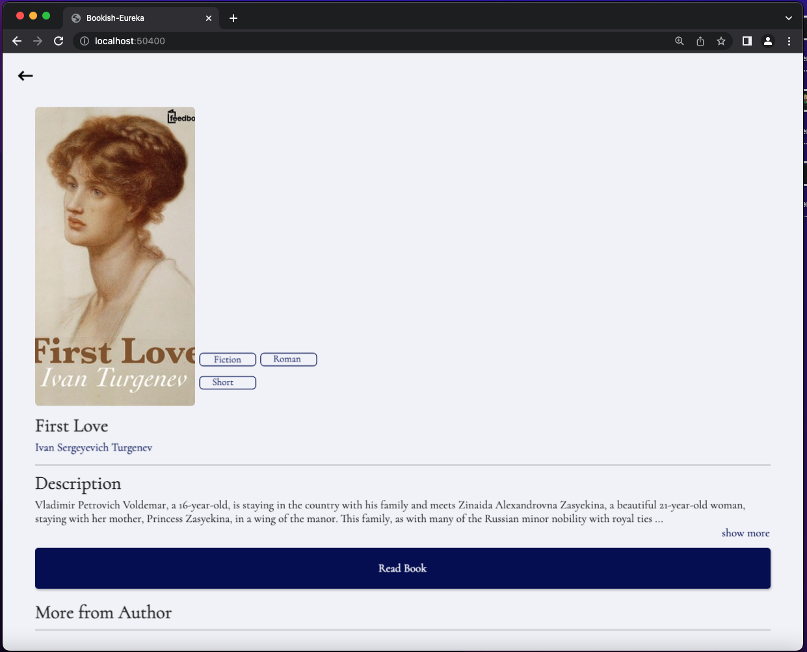

# Flutter Bookish-Eureka

A new Flutter project for entertainment.

## ✨ Requirements

* Any Operating System (ie. MacOS X, Linux, Windows)
* Any IDE with Flutter SDK installed (ie. IntelliJ, Android Studio, VSCode etc)
* A little knowledge of Dart and Flutter
* A brain to think 🤓🤓
## Screenshots

 
 

## Installation

#### 1. [Setup Flutter](https://flutter.dev/docs/get-started/install)

#### 2. Clone the repo

#### 3. Disable security

- Go to flutter\bin\cache and remove a file named: flutter_tools.stamp

- Go to flutter\packages\flutter_tools\lib\src\web and open the file chrome.dart.

- Find '--disable-extensions'
- Add '--disable-web-security'

## Getting Started

This project is a starting point for a Flutter application.

A few resources to get you started if this is your first Flutter project:

- [Lab: Write your first Flutter app](https://docs.flutter.dev/get-started/codelab)
- [Cookbook: Useful Flutter samples](https://docs.flutter.dev/cookbook)

For help getting started with Flutter development, view the
[online documentation](https://docs.flutter.dev/), which offers tutorials,
samples, guidance on mobile development, and a full API reference.
